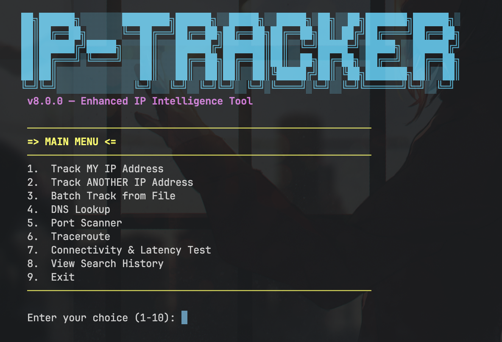
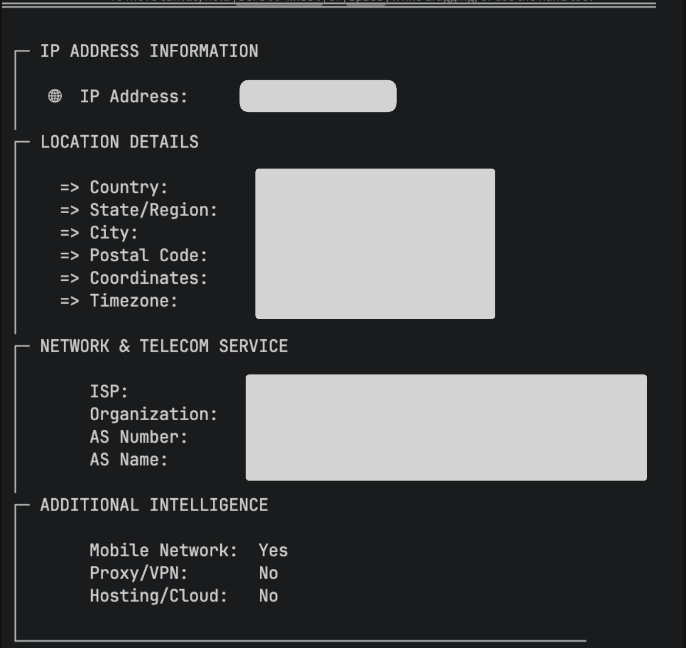
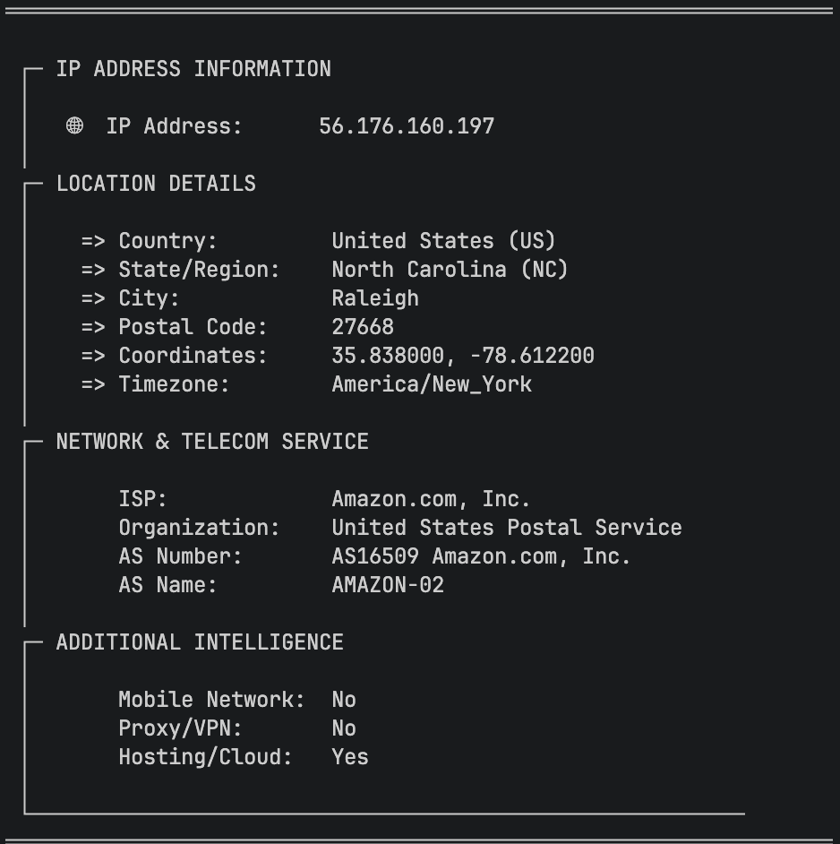

# IP Geolocation Tracker

## Overview

A command-line tool written in Go that retrieves detailed geolocation and network information from any IP address. The application provides both self-tracking and manual IP lookup capabilities with a clean terminal interface.

## Features

| Feature | Description |
|---------|-------------|
| Self IP Tracking | Automatically detects and displays your public IP information |
| Manual IP Lookup | Query any IPv4 or IPv6 address |
| Location Data | Country, state/region, city, postal code, coordinates |
| Network Info | ISP, organization, AS number, AS name |
| Intelligence | Mobile network detection, proxy/VPN detection, hosting/cloud detection |
| Map Integration | Direct Google Maps link from coordinates |

## Screenshots

### Main Menu


### Self Tracking


### Manual IP Lookup


## Requirements

| Requirement | Version |
|-------------|---------|
| Go | 1.21 or higher |
| Internet Connection | Required for API calls |
| Operating System | Linux, macOS, Windows |

## Installation

### Using Go Install

```bash
go install github.com/Devraj-jha/IP-Tracker@latest
```

### Building from Source

```bash
git clone https://github.com/Devraj-jha/IP-Tracker.git
cd IP-Tracker
go build -o IP-Tracker main.go
```

### Direct Download

Download the pre-compiled binary for your operating system from the Releases page.

## Usage

### Run the Application

```bash
./IP-Tracker
```

### Main Menu Options

| Option | Function |
|--------|----------|
| 1 | Track My IP - Automatically detects your public IP |
| 2 | Track Another IP - Prompts for manual IP entry |
| 3 | Exit - Closes the application |

### Command Line Arguments

```bash
# Track a specific IP directly
./IP-Tracker 8.8.8.8

# Track your own IP
./IP-Tracker --self
```

### Example Output

```
==========================================================
 IP GEOLOCATION AND NETWORK INFORMATION
==========================================================

LOCATION DETAILS:
  - IP Address:      8.8.8.8
  - Country:         United States (US)
  - State/Region:    California (CA)
  - City:            Mountain View
  - Postal Code:     94035
  - Coordinates:     37.4220, -122.0840
  - Timezone:        America/Los_Angeles

NETWORK AND TELECOM SERVICE:
  - ISP:             Google LLC
  - Organization:    Google LLC
  - AS Number:       AS15169
  - AS Name:         GOOGLE

ADDITIONAL INFORMATION:
  - Mobile Network:  No
  - Proxy/VPN:       No
  - Hosting/Cloud:   Yes

==========================================================
```

## API Reference

| Service | Endpoint | Purpose | Limits |
|---------|----------|---------|--------|
| ipify.org | https://api.ipify.org | Get public IP address | None |
| ip-api.com | http://ip-api.com/json/{ip} | Geolocation and network data | 45 requests/minute |

## Building for Different Platforms

```bash
# Linux
GOOS=linux GOARCH=amd64 go build -o IP-Tracker-linux main.go

# Windows
GOOS=windows GOARCH=amd64 go build -o IP-Tracker.exe main.go

# macOS Intel
GOOS=darwin GOARCH=amd64 go build -o IP-Tracker-mac-intel main.go

# macOS Apple Silicon
GOOS=darwin GOARCH=arm64 go build -o IP-Tracker-mac-arm main.go
```

## Troubleshooting

| Issue | Solution |
|-------|----------|
| Invalid IP address | Use proper IPv4 (192.168.1.1) or IPv6 (2001:db8::1) format |
| API rate limit | Wait 60 seconds before making another request |
| No internet connection | Check your network connection and firewall |
| Private IP returns no data | Private IPs (192.168.x.x, 10.x.x.x) cannot be geolocated publicly |

## Configuration

No configuration file required. The application works out of the box with default settings.


## Support

Report issues on GitHub Issues page.

---
Made By Devraj-jha.